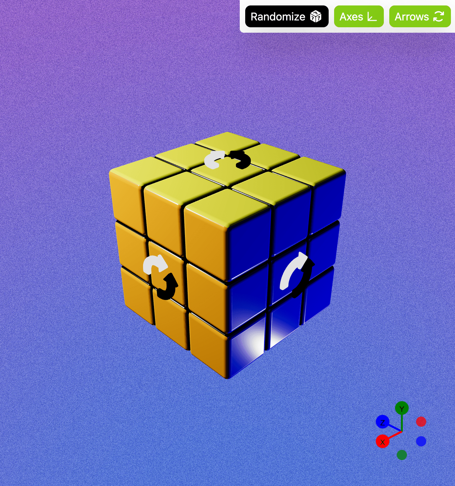

# Rubik's Cube

Welcome to the Interactive 3D Rubik's Cube Simulator! This project showcases an engaging web-based simulator built using React, React Three Fiber, and React Spring. Dive into a realistic 3D environment where you can manipulate, solve, and experiment with a Rubik's Cube right from your browser. Features include arrow controls for clockwise and counterclockwise rotation, a randomizer, and an axis helper to rotate the camera with ease.

## Run

```
git clone https://github.com/mrcleandean/rubikscube.git
cd rubikscube
npm install
npm run dev
```

## Snapshot

